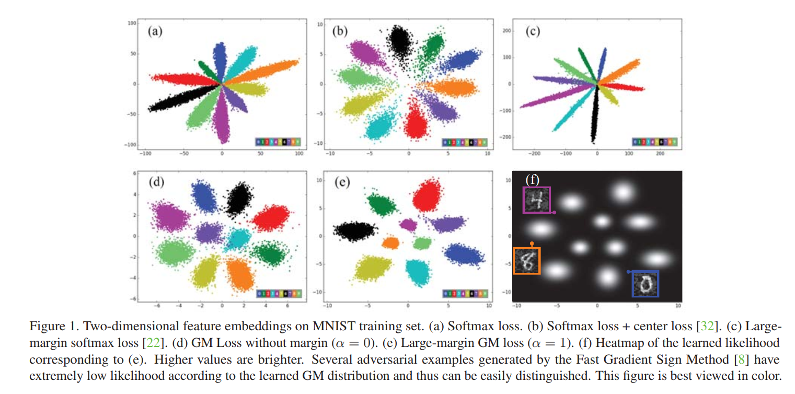

# Rethinking Feature Distribution for loss Functions in Image Classification

> CVPR 2018
>
> 该文对神经网络图片分类任务，提出一种新的损失函数计算方法 large-margin Gaussian Mixture (L-GM) loss。假设训练数据集的特征提取满足一个**Gaussian Mixture Distribution（高斯混合分布）**并引入classification margin 和 likelihood regularization。除了用于分类任务，还可以很好地辨别abnormal inputs，CVPR 2020的一篇ReID方面的论文就是参考了这篇文章的工作

## Comparison

如上图，针对MNIST的分类训练，图a，b，c是使用传统loss function方法的特征分类图，c是无margin的GM loss，d是Large-margin GM loss。

使用GM的优势：

* 在GM中引入classification margin无需像在large-margin softmax loss中需要额外的复杂距离计算
* center loss在形式上等同于GM中的likelihood regularization，但是classification loss 和 likelihood regularization 由于是同一GM假设，**在GM loss中共享相同的特征距离度量**
* 处理改善分类结果，GM loss还可以改善模型的鲁棒性（e.g. toward adversarial examples）

### Other Loss Function
* **contrast loss** in training a Siamese network-------face recognition

* apply **contrast loss** on image triplets rather than on image pairs
	Drawback of the contrastive loss and triplet loss: relay on large-scale datasset
	
* **center loss**: 最小化特征和对应质心的欧式距离，规避了pair-wise 和 triplet-wise的计算问题
	Drawback: 导致特征空间的距离度量不一致性
	
* sofxmax loss中引入**angular margin** 

* **label smoothing** and **knowledge distilling** 

* 在每次训练迭代期间向softmax函数注入**annealed noise** 来解决softmax过早饱和问题
  上面的改进方法都是针对softmax函数的。

  $ p(j|x)=\frac{e^{f_{j}(x)}}{\sum_{k=1}^Ke^{f_{k}(x)}} $

  $ f_{k}(x)=ω_{k}^Tx+b_{k} $
  不过首先，输入特征x的线性输出$f_{k}(x)$不能直接用于估计x在训练特征分布上的可能性，而且网络inner product计算的$f_{k}(x)$应该用余弦距离来度量，而softmax函数由于数学的简单性，更广泛采用欧氏距离的正则化。
## Gaussian Mixture Loss
### GM loss Formulation
首先假设训练集中提取的特征x服从Gaussian Mixture Distribution，公式如下

$p(x)=\sum_{k=1}^KN(x;\mu_{k},\sum_{k})p(k)$

p(k)是类别k的先验概率，$\mu_{k}$和$\sum_{k}$分别是class k在特征空间的均值和方差

则对于训练数据$x_{i}$给出它的class label$z_{i}\in[1,K]$ 

条件概率为：$p(x_{i}|z_{i})=N(x_{i};/mu_{z_{i}},\sum_{z_{i}})$

后验概率为：$p(z_{i}|x_{i})=\frac{N(x_{i};/mu_{z_{i}},\sum_{z_{i}})p(z{i})}{\sum_{k=1}^KN(x_{i};\mu_{z_{k}},\sum_{k})p(k)}$

故计算后验概率分布和one-hot label的交叉熵得到classification loss $L_{cls}=-\frac{1}{N}\sum_{i=1}^Nlog\frac{N(x_{i};\mu_{z_{i}},\sum_{z_{i}})p(z_{i})}{\sum_{k=1}^KN(x_{i};\mu_{k},\sum_{k})p(k)}$ 

然而，仅优化classification loss不能直接地从GM分布中提取训练特征，例如，即使一个远离分类中心点的特征，只要保证他离其他特征中心点更远，就会被判定为这个类别。故引入**likelihood regularization** $L_{lkd}$用于度量训练样本在多大的程度上符合假设的分布。

最终得到GM loss $L_{GM}=L_{cls}+\lambda L_{lkd}$      $\lambda 是权重$

### Large-Margin GM Loss

在统计机器学习领域，广泛认为large classification margin可以帮助更好地泛化，在深度学习领域也同样认为有效。

用$L_{cls,i}$表示$x_{i}$对于classification loss的contribution

$L_{cls,i}^m=-log\frac{p(z_{i})|\sum_{z_{i}}|^{-\frac{1}{2}}e^{-d_{z{i}}-m}}{\sum_{k}p(k)|\sum_{k}|^{-\frac{1}{2}}e^{-d_{k}-1(k=z_{i})m}}$

由于公式中squared Mahalanobis distance $d_{k}$非负，classification margin m（m>=0）可以easily introduced 实现large-margin GM loss。

### Optimization

GM loss可以通过SGD梯度算法进行优化